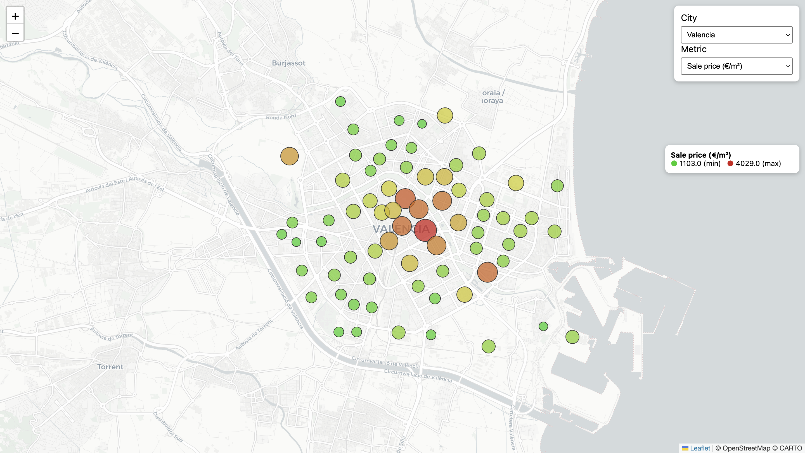
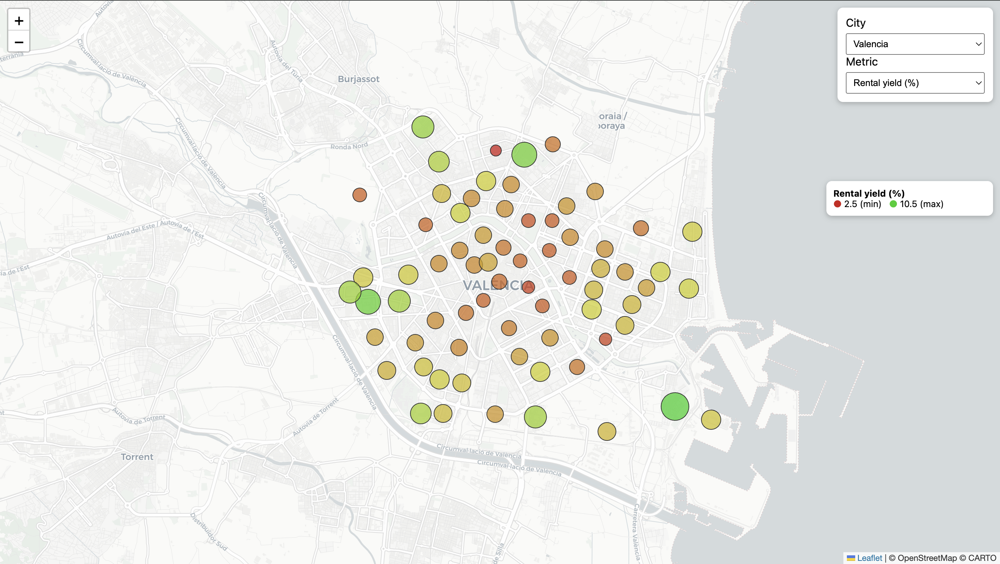
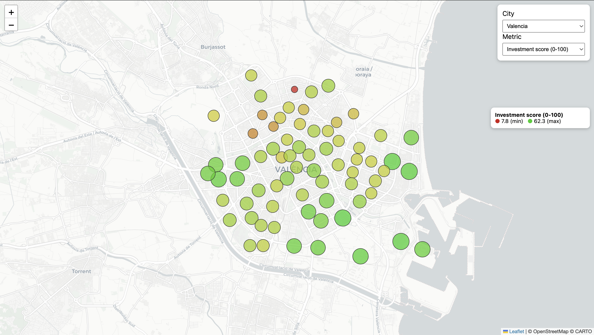

# Real Estate Investment Heatmap 

Interactive map that helps property investors identify the best neighborhoods
to buy in, based on real market data from Valencia, Spain.

## What it does

For each of Valencia's 70 neighborhoods, the tool displays four investment
metrics as color-coded bubbles on an interactive map:

- **Sale price (€/m²)** — average asking price (2022)
- **Rental yield (%)** — gross annual return if you buy and rent out: `(monthly rent × 12) / sale price`
- **Annual growth (%)** — CAGR of sale prices between 2010 and 2022
- **Investment score (0-100)** — composite metric combining normalized yield and growth (50/50), highlighting neighborhoods that balance cashflow and appreciation

Green always means "good for the investor", regardless of the metric.

| Rental yield | Investment score |
|---|---|
|  |  |

## Architecture

Open data (GPKG/CSV) → data load (SQL) → MySQL → PHP REST API → Leaflet.js frontend

- **Database:** MySQL, normalized schema (`cities` → `zones` → `prices`)
- **Backend:** PHP 8 with PDO and prepared statements — three endpoints (`cities`, `zones`)
- **Frontend:** Vanilla JavaScript + Leaflet 1.9, no framework
- **Multi-city ready:** adding a new city only requires loading its data, no code changes

## Data source

[Valencia City Council Open Data](https://opendata.vlci.valencia.es/)
(housing prices from Idealista), cleaned and merged by
[Data Enhance UV](https://www.uv.es/dataenhance/). License: CC-BY 4.0.
70 neighborhoods, sale prices (2010 & 2022) and rental prices (2022).

## How to run locally

1. Requirements: XAMPP (Apache + MySQL + PHP 8)
2. Create a MySQL database named `realestate` and import `data/load_valencia.sql`
3. Copy `api/config.example.php` to `api/config.php` and set your DB credentials
4. Place the project folder inside `htdocs/` and open
   `http://localhost/realestate/public/index.html`

## Metrics explained

- **Rental yield** cancels out the flat size (both prices are €/m²), giving a clean
  gross return per euro invested. It is *gross* — it doesn't subtract taxes, vacancy
  or maintenance.
- **Annual growth** uses CAGR (compound annual growth rate), the financial standard
  for growth between two dates, rather than a naive average.
- **Investment score** normalizes yield and growth to a 0–1 range (min-max) and
  combines them 50/50. Two neighborhoods can reach a similar score through opposite
  profiles (high cashflow vs high appreciation).

## Known limitations & future work

- Growth uses only 2 time points (2010, 2022); with longer series (INE/MITMA) the
  same pipeline supports proper regression models
- Rental yield is gross (doesn't account for taxes, vacancy or maintenance)
- Investment score weights (50/50) could be user-configurable via a slider
- Refactor: extract the yield/growth SQL into reusable query builders to reduce duplication
- Planned: choropleth view using the neighborhood polygons, price prediction endpoint,
  public demo deployment
